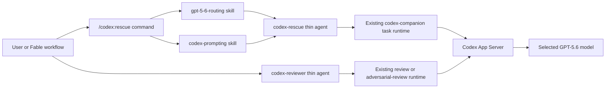

# Codex CC Relay Plugin Design

**Status:** Approved for implementation planning

**Date:** 2026-07-10

**Initial relay version:** 1.1.6

**Upstream base:** `openai/codex-plugin-cc` v1.0.6 at `db52e28`

## Summary

`codex-cc-relay-plugin` is a compatibility-first fork of
[`openai/codex-plugin-cc`](https://github.com/openai/codex-plugin-cc). It keeps the
upstream command namespace, runtime, history, and Apache-2.0 license while adding a
small relay layer for Claude Fable 5 to delegate appropriate tasks to GPT-5.6.

The first release adds five capabilities only:

1. Fable-selected GPT-5.6 model and reasoning-effort routing for fresh
   `/codex:rescue` tasks.
2. A compact, model-neutral prompting skill based on OpenAI's GPT-5.6 guidance.
3. A model-invocable, read-only `codex-reviewer` agent.
4. Explicit `task --resume-id <threadId>` support.
5. Two baseline correctness fixes: valid hook metadata and hermetic tests.

The separate `fable-codex-workflow` project will own research and planning workflows,
task graphs, worktree allocation, multi-worker sequencing, and synthesis. Those
features are not part of this plugin design.

## Goals

- Preserve upstream behavior when the relay features are not used.
- Let the main Fable session select an appropriate GPT-5.6 model and effort from the
  shape of a fresh rescue task.
- Keep routing and prompting policies in internal skills so they can be changed
  without coupling policy to the Node.js runtime.
- Preserve the user's task text and return Codex foreground output verbatim.
- Expose a safe programmatic reviewer and deterministic thread resumption for the
  future workflow project.
- Retain upstream history and make upstream synchronization easy to audit.

## Non-goals

The initial release will not add or plan the following:

- Dynamic App Server model-catalog discovery or model/effort pair validation.
- Changes to how the runtime applies a model to App Server requests.
- Concurrent state locking or atomic job-index writes.
- New background-job semantics, result collection, broker recovery, or timeouts.
- Worktree management inside the plugin.
- Plan-review, review-to-rescue, computer-use, image-generation, usage, or agent-TUI
  commands.
- Automatic routing for review commands.
- Any unconfirmed community issue or pull-request proposal.

## Repository and Upstream Strategy

The connector lives at `D:\PersonalProjects\codex-cc-relay-plugin`. The workflow
project lives separately at `D:\PersonalProjects\fable-codex-workflow`.

The connector repository retains upstream Git history. The upstream remote is named
`upstream` and points to `https://github.com/openai/codex-plugin-cc.git`. A future
user-owned remote will be named `origin`.

The fork keeps:

- Apache-2.0 licensing and upstream notices.
- The `codex` plugin name and `/codex:*` command namespace.
- Existing commands and their default behavior.
- Upstream directory structure unless a relay feature requires an additive file.

An `UPSTREAM.md` file will record the upstream repository, tag, exact commit, last
synchronization date, and synchronization procedure. Relay changes should remain in
small, reviewable commits so future upstream merges are straightforward.

## Versioning

The initial upstream-to-relay mapping is:

- Upstream `1.0.6` -> relay `1.1.6`.

The package version, plugin manifest version, marketplace metadata, and changelog
version must agree. The patch component tracks the synchronized upstream patch when
possible. A relay-only release increments the relay minor while retaining the
upstream patch, for example `1.2.6`. `UPSTREAM.md` remains authoritative for the
exact base version and commit.

## Architecture



The main Fable session owns task interpretation. The Sonnet relay agents remain
mechanical forwarders and do not inspect the repository, solve the task, or
reinterpret the requested work.

## Component Design

### 1. GPT-5.6 Routing Skill

Add `plugins/codex/skills/gpt-5-6-routing/SKILL.md` as an internal,
non-user-invocable skill. It is the source of truth for rescue routing policy.
`commands/rescue.md` explicitly invokes it when a fresh task is missing either a
model or an effort.

The main Fable session evaluates:

- task breadth and number of affected components;
- ambiguity and need for repository exploration;
- implementation or diagnosis depth;
- reversibility and risk;
- required verification; and
- whether the task is bounded or likely to require a long autonomous run.

The default routing tiers are:

| Task shape | Model | Effort |
| --- | --- | --- |
| Small, routine, tightly bounded work | `gpt-5.6-luna` | `low` |
| Normal bounded implementation or diagnosis | `gpt-5.6-terra` | `medium` |
| Broad, ambiguous, cross-component, or high-value work | `gpt-5.6-sol` | `high` |
| Architectural, high-risk, or unusually difficult work | `gpt-5.6-sol` | `xhigh` |

Automatic routing never selects `max`. A user may request `max` explicitly. The
runtime's static effort allowlist will accept `max`, but the relay will not add
dynamic per-model validation. `ultra` is not treated as a reasoning effort.

Routing precedence is:

1. Explicit model and effort: forward both unchanged; do not route.
2. Explicit model only: Fable selects effort.
3. Explicit effort only: Fable selects model.
4. Neither explicit: Fable selects both.
5. Ambiguous boundary: select the safer higher tier.

Routing applies to fresh tasks only. Resumed threads preserve their existing model
and effort unless the user explicitly overrides them. If Fable cannot make a valid
routing decision, it leaves the missing values unset and preserves upstream
defaults. The relay does not query the App Server model catalog or silently choose a
fallback model.

### 2. Model-neutral Codex Prompting Skill

Replace the model-locked prompting concept with
`plugins/codex/skills/codex-prompting/SKILL.md`. The skill is internal and is invoked
by the main Fable command layer, not by the thin Sonnet forwarder.

OpenAI's GPT-5.6 guidance favors shorter prompts, task-relevant context, one compact
authorization boundary, observable success criteria, and lightweight output
structure. It also warns that generic brevity instructions can cause required work
to be omitted. The relay therefore uses a small work-order envelope instead of the
upstream library of many reusable XML blocks.

For a fresh task, the maximum default shape is:

```xml
<task>
[original task text preserved exactly]
</task>

<scope_and_success>
[only explicit scope, authorization, constraints, and observable completion criteria]
</scope_and_success>

<evidence_and_final_response>
Verify the result using relevant files or tool output.
Lead with the outcome. Include required evidence, checks performed,
material caveats, and the next action when one remains.
Remove repetition only after preserving all required information.
</evidence_and_final_response>
```

Prompting rules:

- Preserve the original task text exactly inside `<task>`.
- Omit optional blocks when they add no task-specific value.
- Do not add generic `be concise`, `think harder`, or chain-of-thought requests.
- Keep model and effort selection in runtime flags, not prompt prose.
- State write authorization and irreversible-action boundaries once.
- Use the same prompt contract for Sol, Terra, and Luna; no official source supports
  separate syntax for the variants.
- For a resumed thread, send only the new delta instruction. Do not repeat the
  original work order unless the goal or constraints materially changed.
- Built-in review and adversarial-review prompts retain their own contracts and do
  not use this wrapper.

### 3. Rescue Command and Agent

`commands/rescue.md` remains the entry point. For fresh work it invokes routing and
prompting in the main Fable context, then delegates once to `codex:codex-rescue`.
Existing explicit execution, resume, model, effort, write, and task-text semantics
remain intact.

`agents/codex-rescue.md` remains a Sonnet thin forwarder with one Bash call to the
companion `task` subcommand. It does not evaluate complexity, shape prompts, inspect
files, perform work, poll, or summarize. Foreground Codex output is returned
verbatim.

### 4. Programmatic Codex Reviewer

Add `plugins/codex/agents/codex-reviewer.md`, based on the bounded design in upstream
[PR #462](https://github.com/openai/codex-plugin-cc/pull/462).

The reviewer agent:

- performs exactly one Bash call;
- invokes `review` for a normal review and `adversarial-review` only when the request
  includes focus text, custom instructions, or explicitly adversarial framing;
- defaults to foreground execution;
- permits only review-compatible flags;
- never invokes `task`, adds `--write`, edits files, or uses rescue resume semantics;
- returns runtime stdout verbatim; and
- does not apply automatic GPT-5.6 routing in the initial release.

This provides the future workflow project with a stable, read-only programmatic
review interface without embedding plan-review or orchestration policy in the
connector.

### 5. Explicit Thread Resumption

Add `task --resume-id <threadId>` to the companion runtime, following the additive
surface proposed in upstream
[PR #231](https://github.com/openai/codex-plugin-cc/pull/231).

Rules:

- `--resume-id` resumes the exact supplied Codex thread.
- Existing `--resume` and `--resume-last` behavior is unchanged.
- `--resume-id` is mutually exclusive with `--fresh` and implicit latest-thread
  selection.
- It works in foreground and existing companion background mode.
- Invalid or unavailable thread IDs use the existing App Server failure path.
- Explicit resume does not trigger fresh-task automatic routing.

### 6. Baseline Correctness

Two upstream-reported corrections are included because they affect the validity and
repeatability of the fork itself:

1. Remove the unsupported top-level `description` key from
   `plugins/codex/hooks/hooks.json`, as reported in
   [issue #459](https://github.com/openai/codex-plugin-cc/issues/459). Add a schema
   regression assertion that the only top-level key is `hooks`.
2. Make tests hermetic inside a live Claude Code session, following the narrow test
   isolation from [PR #456](https://github.com/openai/codex-plugin-cc/pull/456): use a
   temporary `CLAUDE_PLUGIN_DATA` root and clear inherited
   `CODEX_COMPANION_SESSION_ID` except in tests that set it explicitly.

No other community hardening item is included or placed on the future roadmap.

## Data and Output Contracts

The relay adds no new persistent routing database. Model and effort remain command
arguments passed into the existing runtime. Existing job and thread records remain
the source of truth for resumption.

The user-visible foreground contract remains upstream-compatible: output from Codex
is returned verbatim. Routing or prompt metadata must not be appended to the answer.
Diagnostics may be added only to existing structured or status surfaces if that can
be done additively without changing normal output.

## Error Handling

The relay deliberately avoids a new error framework in this release.

- Invalid static effort values fail through the companion's existing validation.
- `max` is added to that static accepted set; `ultra` is not.
- Unavailable model names, unsupported model/effort combinations, and invalid thread
  IDs are reported by the existing App Server/runtime path.
- If Fable cannot produce a routing decision, missing flags remain unset and upstream
  defaults apply.
- Existing setup/authentication guidance remains unchanged.

## Testing Strategy

All upstream tests must continue to pass. New tests cover only the approved changes.

### Command and skill contract tests

- Rescue invokes routing only for fresh tasks with missing runtime controls.
- Explicit model and effort always win.
- Resumes do not reroute unless explicitly overridden.
- `max` is accepted explicitly and never selected automatically.
- `ultra` is rejected as an effort.
- Prompt skill preserves original task text exactly.
- Optional prompt blocks remain optional and generic brevity language is absent.
- Resume prompts contain only the delta instruction.
- Rescue and reviewer agents remain one-call thin forwarders.
- Reviewer cannot invoke write or task paths.

### Runtime tests

- `task --resume-id` forwards the supplied thread ID.
- `--resume-id` rejects conflicting fresh/latest flags.
- Existing `--resume` and `--resume-last` tests remain unchanged.
- Foreground and background resume-id paths use existing behavior.

### Baseline tests

- Hook configuration has exactly one top-level `hooks` key.
- A full suite run under inherited Claude/Codex session variables uses only temporary
  fixture state and does not leak into real plugin data.

### Manual smoke tests

- Fresh small, normal, complex, and high-risk rescue requests route to the expected
  static tier.
- Explicit routing flags are preserved.
- A resumed thread preserves its prior runtime selection.
- Fable can invoke the reviewer agent and receive verbatim review output.
- A specific thread can be continued by ID.

## Acceptance Criteria

The design is successfully implemented when:

- the relay is versioned `1.1.6` everywhere;
- upstream commands work unchanged without relay-specific input;
- Fable routes fresh rescue tasks according to the approved static GPT-5.6 policy;
- explicit flags and resumed-thread behavior take precedence over routing;
- fresh task text is preserved exactly inside the compact prompt contract;
- `codex-reviewer` provides a read-only programmatic review path;
- `task --resume-id` deterministically resumes a supplied thread;
- hook metadata is valid and tests are hermetic;
- the upstream test suite and new relay tests pass; and
- no non-approved community feature or hardening change is included.

## Research Basis

This design is based on:

- [OpenAI GPT-5.6 model guidance](https://developers.openai.com/api/docs/guides/latest-model),
  especially its shorter-prompt, task-relevant-tool, explicit-autonomy, verification,
  and output-prioritization recommendations.
- [OpenAI GPT-5.6 Sol](https://developers.openai.com/api/docs/models/gpt-5.6-sol),
  [Terra](https://developers.openai.com/api/docs/models/gpt-5.6-terra), and
  [Luna](https://developers.openai.com/api/docs/models/gpt-5.6-luna) model pages.
- [CodeRabbit's GPT-5.6 Sol and Terra benchmark](https://www.coderabbit.ai/blog/gpt-5-6-sol-and-terra-benchmark).
- [Every's GPT-5.6 evaluation](https://every.to/vibe-check/gpt-5-6).
- Upstream repository structure, current commands, skills, runtime, issues, and pull
  requests as of 2026-07-10.

## Next Step

After user review of this committed specification, create a separate implementation
plan using the `superpowers:writing-plans` workflow. Do not implement connector
features before that plan is approved for execution.
