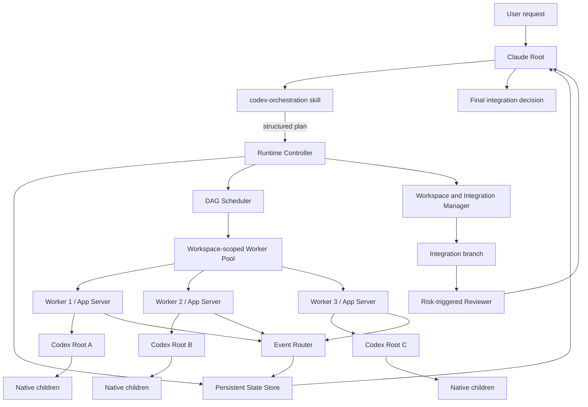
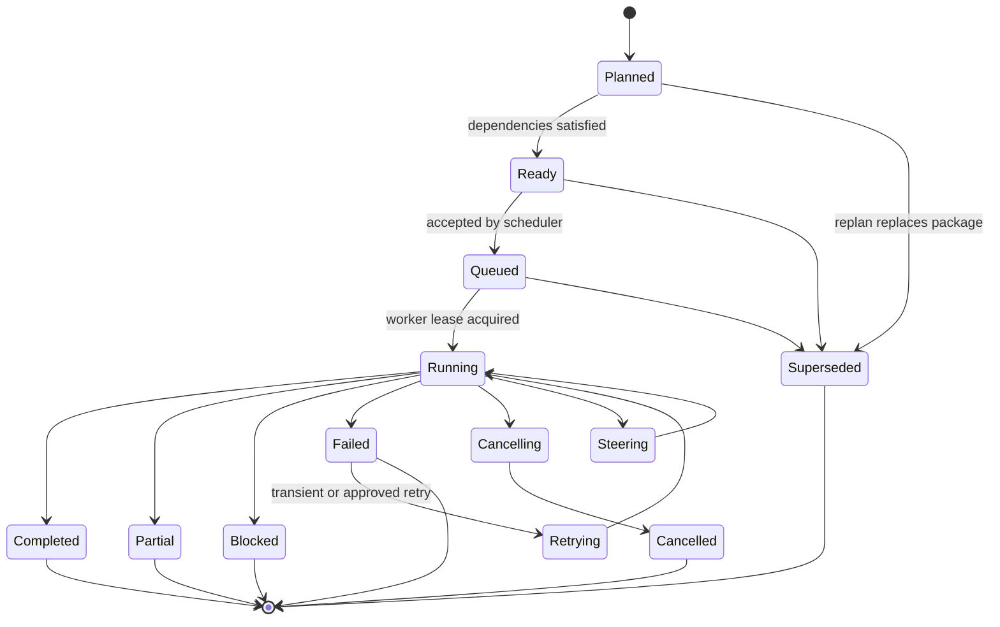

# Claude-Native Multi-Codex Orchestration Layer

- **Status:** Approved design
- **Date:** 2026-08-17
- **Target repository:** `eureka-pd/codex-plugin-cc`
- **Primary owner:** Claude Root Agent
- **Runtime substrate:** Codex App Server
- **Initial model policy:** GPT-5.6 Sol, Terra, and Luna

## 1. Executive summary

This design extends the Claude Code Codex plugin from a single delegated Codex task into a Claude-native, multi-Codex orchestration layer.

Claude remains the root orchestrator and owns semantic decisions:

- whether orchestration is appropriate;
- decomposition into bounded work packages;
- dependency and execution planning;
- model, reasoning-effort, access, and workspace assignment;
- replanning, escalation, and reviewer placement;
- integration judgment and final user-facing conclusions.

A deterministic Node.js runtime controller owns mechanical execution:

- a bounded Codex App Server worker pool;
- top-level Codex thread and turn lifecycle;
- notification routing and result capture;
- DAG scheduling and package state transitions;
- timeout, interruption, retry, and cancellation;
- persistent orchestration state and restart recovery;
- Git snapshots, package worktrees, integration branches, and cleanup.

Each top-level Codex Root receives one bounded work package. A Codex Root may use native Codex child agents when the model supports them and the package budget permits it. Claude observes those child-agent events but does not bypass the Codex parent to steer the children directly.

The feature is hybrid at every important boundary:

- explicit `/codex:orchestrate` invocation plus opt-in automatic entry;
- read-only agents sharing safe state plus isolated writer worktrees;
- an initial DAG plus limited dynamic replanning;
- role-based model defaults plus dynamic escalation;
- evidence-based Claude integration plus risk-triggered Sol review;
- in-plugin deployment plus an internal boundary suitable for later extraction.

## 2. Problem statement

The current plugin is optimized for a single Codex delegation or review at a time. Its rescue subagent is deliberately a thin forwarder, and the shared broker serializes active streaming operations through a single active request/stream owner. This is appropriate for one task, but it prevents Claude from acting as a genuine root orchestrator over several independent Codex Roots.

Complex repository work commonly contains independent concerns that benefit from parallel execution:

- architecture analysis and implementation;
- frontend and backend work;
- migration design and rollback analysis;
- implementation and independent verification;
- competing hypotheses in an unclear debugging problem;
- separate security, concurrency, and regression reviews.

Delegating all of these to one Codex thread creates several failure modes:

- unnecessary serial latency;
- one model tier and effort applied to heterogeneous work;
- weak isolation between parallel writers;
- context dilution in long-running tasks;
- a single failure blocking unrelated progress;
- no explicit dependency graph or evidence contract;
- no durable orchestration-level recovery state.

The desired system must allow Claude to coordinate several Codex Roots without surrendering top-level intent, without allowing unbounded agent growth, and without exposing the user's active branch to incomplete parallel changes.

## 3. Goals

The system shall:

1. Allow Claude to start multiple top-level Codex Roots for one user task.
2. Preserve Claude as the owner of decomposition, scheduling intent, replanning, and final judgment.
3. Execute independent top-level Codex Roots concurrently through a bounded App Server worker pool.
4. Allow each Codex Root to use native child agents inside its assigned package when supported.
5. Support both explicit orchestration and opt-in automatic orchestration.
6. Allow local write-capable orchestration to start automatically when enabled.
7. Keep external, destructive, publication, deployment, and remote mutation actions behind explicit user approval.
8. Isolate multiple writers through Git worktrees and package branches.
9. Preserve a stable snapshot when the user's working tree is dirty without modifying the user's index, branch, or working tree.
10. Integrate verified package commits on an isolated integration branch before touching the user's branch.
11. Validate results through structured evidence, executable verification, and risk-triggered independent review.
12. Persist orchestration state sufficiently to recover from Claude Code reloads, controller restarts, and worker failures.
13. Bound agent count, model tier, retries, replans, and elapsed time through an adaptive budget envelope.
14. Extend existing `status`, `result`, and `cancel` surfaces rather than creating a large command vocabulary.
15. Remain testable on macOS, Linux, and Windows.
16. Preserve module boundaries that allow upstream contribution in smaller pull requests.

## 4. Non-goals

The initial system does not aim to:

- replace Claude with a Codex lead agent;
- let Claude directly control native Codex child agents owned by a Codex Root;
- provide shared hidden reasoning or shared mutable memory between Claude and Codex;
- distribute workers across multiple machines;
- create an unbounded autonomous software-development loop;
- automatically push, open or merge pull requests, publish packages, or deploy systems;
- guarantee perfect confinement while using `danger-full-access`;
- become a general-purpose workflow engine unrelated to Codex delegation;
- make every repository task use multiple agents;
- expose every controller operation as a separate slash command;
- require users to commit or stash their existing work before orchestration.

## 5. Terminology

| Term | Definition |
|---|---|
| **Orchestration** | One Claude-managed multi-Codex execution created for a user objective. |
| **Claude Root** | The Claude Code agent that owns semantic planning and final integration judgment. |
| **Work package** | A bounded top-level task with explicit dependencies, ownership, access, acceptance criteria, and result contract. |
| **Codex Root** | One top-level Codex thread assigned to one work package and owned directly by Claude orchestration. |
| **Native child** | A Codex subagent spawned and owned by a Codex Root through native multi-agent tools. |
| **Worker** | One long-lived Codex App Server process, one controller client, and one active top-level Codex Root lease. |
| **Workspace** | A Git repository root or non-Git working directory in which orchestration operates. |
| **Package branch** | A temporary branch containing one writer package's normalized atomic commit. |
| **Integration branch** | A temporary branch where package commits are combined, conflicts are resolved, and verification is executed. |
| **Snapshot ref** | An internal Git ref representing the user's complete working-tree content at orchestration start. |
| **Decision point** | A state requiring Claude semantic judgment, such as a structural failure, conflict, or reviewer rejection. |

## 6. Decision summary

The approved design decisions are:

| Concern | Decision |
|---|---|
| Invocation | Hybrid: explicit command plus opt-in automatic entry. |
| Automatic local writes | Allowed after compressed plan notification. |
| Workspace isolation | Hybrid: safe readers may share; multiple writers use worktrees. |
| Topology | Claude-managed top-level Codex Roots; Codex-managed native children. |
| Model routing | Role defaults plus Luna → Terra → Sol escalation. |
| App Server allocation | Bounded workspace-scoped worker pool. |
| Scheduling | Initial DAG plus limited dynamic replanning. |
| Integration | Evidence-based Claude judgment plus risk-triggered Reviewer. |
| Persistence | Durable control plane with scoped recovery. |
| Commands | Add `/codex:orchestrate`; extend `status`, `result`, and `cancel`. |
| User notification | Compressed plan notification, then immediate start. |
| Auto-entry | Hard exclusions plus Complexity Score. |
| Budget | Complexity-adaptive envelope with absolute caps. |
| Failure handling | Package-scoped circuit breaker and conditional partial integration. |
| Git integration | Package branches → integration branch → review → squash. |
| Execution ownership | Claude judgment plus deterministic runtime controller. |
| Deployment boundary | In-plugin modules with an independent application boundary. |
| Implementation | Three phases: read-only, clean-tree writers, recovery/dirty-tree. |
| Skill layout | One root orchestration skill plus internal policy skills. |
| Configuration | Dedicated user/project JSON configuration with schema. |
| Auto-enable | Explicit one-time enablement; explicit command always available. |
| Worker reuse | Workspace pool, global cap, ten-minute idle TTL. |
| Native-agent fallback | A required-but-unavailable native child policy degrades to Root-only execution. |
| Dirty tree | Hidden snapshot commit using a temporary index. |
| Final commit | One local squash commit when automatic application is safe. |
| Commit identity | User Git identity, orchestration/package trailers. |
| Safety | App Server approval mediation, command deny rules, prompt policy, and audit. |
| Progress output | Milestone-oriented chat output; detailed local event log. |
| Cancellation | Interrupt, grace period, process-tree termination, partial-state recovery. |
| Retention | Time-bounded metadata, logs, refs, and failed worktrees. |
| Result format | Canonical JSON plus Markdown renderer. |
| Platforms | macOS, Linux, and Windows from the first complete release. |
| Upstream strategy | Complete in the fork while preserving small PR boundaries. |

## 7. Architectural principles

### 7.1 Claude owns meaning; the controller owns mechanics

The controller shall never invent or materially reinterpret the plan. It validates and executes structured instructions. Claude decides what work exists, whether results are sufficient, and how conflicts are resolved.

### 7.2 Top-level parallelism must correspond to real independence

A high Complexity Score alone does not justify parallel writers. Claude must identify independent package ownership, stable interfaces, or a read-only comparison purpose. If several tasks modify the same semantic core, the plan shall collapse to one writer plus one or more read-only reviewers.

### 7.3 Every package is independently understandable

A package must state:

- what it is expected to accomplish;
- what it may read and write;
- what other packages it depends on;
- how completion will be verified;
- what evidence it must return;
- which files, APIs, schemas, or domains it owns.

### 7.4 Evidence outranks self-reported confidence

A package's confidence value is advisory. Acceptance depends on repository evidence, command results, diff inspection, contract compatibility, and reviewer findings.

### 7.5 Failures are isolated before they are escalated

A failed package blocks only its dependent subgraph unless the package is required for the overall objective. Independent branches continue within the approved budget.

### 7.6 User work is never silently rewritten to enable orchestration

The system does not stash, reset, commit, or modify the user's index merely to create a stable base. It creates an internal snapshot ref with a temporary index.

### 7.7 Automatic local action does not imply automatic external action

Local repository edits, tests, builds, and static analysis may start automatically. Push, publication, deployment, remote data mutation, credential changes, and destructive external actions require explicit user approval.

## 8. System architecture



### 8.1 Separation from the existing single-job path

The existing `codex-companion` and serialized shared broker remain responsible for single rescue and review jobs. Multi-Codex orchestration uses a separate controller and dedicated App Server worker pool.

Shared implementation utilities may include:

- generated App Server protocol types;
- model-catalog access;
- process-tree management;
- filesystem helpers;
- structured-output parsing;
- rendering and redaction utilities.

The following remain separate:

- broker ownership;
- orchestration state;
- DAG scheduling;
- worker leasing;
- workspace snapshots;
- package branch management;
- recovery and integration state.

This avoids weakening the stable single-job behavior while the orchestration runtime matures.

## 9. Invocation and user experience

### 9.1 Explicit invocation

```text
/codex:orchestrate <task>
```

Explicit invocation is always available, even when automatic orchestration is disabled.

### 9.2 Automatic invocation

Automatic invocation is controlled by:

```text
/codex:setup --enable-orchestration
/codex:setup --disable-orchestration
```

The setting applies to Claude's automatic selection only. When enabled, Claude may automatically start read-only or write-capable local orchestration if the task passes the entry policy.

### 9.3 Compressed plan notification

Claude does not wait for approval before local execution. It emits a short plan and starts immediately.

Example:

```text
Starting Multi-Codex orchestration orch-20260817-a31f.

- Architecture: Sol / high / read-only
- Backend: Terra / high / isolated writer
- Regression verification: Luna / medium / snapshot reader
- Parallelism: 3; base budget: 30 minutes
- External actions: none
```

A replan emits only the delta:

```text
Plan revision 2:
- Split persistence from the backend package.
- Escalated persistence to Terra / max.
- Package count changed from 3 to 4.
```

### 9.4 Command surface

New command:

```text
/codex:orchestrate <task>
```

Extended commands:

```text
/codex:status [orchestration-id|package-id|job-id]
/codex:result [orchestration-id|package-id|job-id]
/codex:cancel [orchestration-id|package-id|job-id]
```

Existing single-agent command:

```text
/codex:rescue
```

Maintenance commands:

```text
/codex:setup --enable-orchestration
/codex:setup --disable-orchestration
/codex:setup --prune-orchestrations
/codex:setup --prune-orchestrations --all
```

No `/codex:status --watch` mode is included in the initial scope.

## 10. Automatic-entry policy

### 10.1 Hard exclusions

Claude shall normally avoid Multi-Codex orchestration when any of these conditions applies:

- a one-file local change has an obvious solution;
- root cause and fix are already established;
- the task is a single command or a narrow information lookup;
- no independent work packages can be identified;
- orchestration overhead is likely larger than the work;
- all plausible writers must edit the same semantic core;
- the user explicitly requests a single-agent execution.

### 10.2 Complexity Score

Claude assigns one point for each applicable condition:

1. Two or more independent work packages exist.
2. The task spans multiple modules, layers, or services.
3. Architecture or design judgment is material.
4. The root cause is unclear.
5. Competing implementation approaches require comparison.
6. The change warrants an independent reviewer.
7. Implementation and testing can run independently.
8. A single Codex execution is expected to be long-running.
9. A previous single-agent attempt failed.
10. The task affects security, concurrency, migration, data loss, or another high-risk area.

### 10.3 Score interpretation

| Score | Default behavior |
|---:|---|
| 0–2 | Claude handles directly or uses one `/codex:rescue`. |
| 3–4 | Claude may orchestrate up to two top-level Roots. |
| 5–7 | Automatic Multi-Codex orchestration is preferred. |
| 8–10 | Include a Sol architecture/plan-validation or Reviewer package. |

A `planner` package at high complexity may validate a bounded technical plan, but Claude retains ownership of the orchestration DAG and final plan.

## 11. Skill architecture

### 11.1 `codex-orchestration`

Path:

```text
plugins/codex/skills/codex-orchestration/SKILL.md
```

This is the only orchestration skill intended for automatic model invocation. It defines:

- entry and exclusion rules;
- Complexity Score calculation;
- plan and package creation;
- role and model routing;
- compressed user notification;
- controller invocation;
- decision-point handling;
- replan and escalation rules;
- final integration and response requirements.

The skill must explicitly prohibit delegating top-level semantic planning to a Codex Root.

### 11.2 `codex-work-package-contract`

Path:

```text
plugins/codex/skills/codex-work-package-contract/SKILL.md
```

Internal, non-user-invocable policy for:

- bounded objective formulation;
- dependencies and ownership;
- read/write scope;
- acceptance criteria;
- structured output requirements;
- native-child policy;
- timeout and retry budget.

### 11.3 `codex-integration-policy`

Path:

```text
plugins/codex/skills/codex-integration-policy/SKILL.md
```

Internal policy for:

- package commit validation;
- integration ordering;
- conflict and overlap decisions;
- reviewer placement;
- verification sufficiency;
- final squash and user-branch application.

### 11.4 `codex-orchestration-recovery`

Path:

```text
plugins/codex/skills/codex-orchestration-recovery/SKILL.md
```

Internal policy for:

- interrupted controller or worker state;
- partial package changes;
- existing package and integration branches;
- same-session automatic recovery;
- new-session resume choices;
- safe cleanup and retention.

### 11.5 No LLM orchestrator subagent

There is no separate Claude orchestrator subagent. Claude Root reads the orchestration skill and retains direct ownership of planning and integration. The runtime controller is deterministic, not an LLM.

## 12. Work-package contract

A package must validate against a JSON Schema equivalent to the following conceptual shape:

```yaml
id: pkg-backend-auth
title: Implement authentication backend

role:
  class: implementer
  label: authentication-backend-implementer

objective: >
  Implement the authentication backend while preserving the public API
  and current session semantics.

dependencies:
  - pkg-auth-contract

required: true
access: write

ownership:
  files:
    - src/auth/**
    - tests/auth/**
  interfaces:
    - auth-session-contract

workspace:
  mode: isolated-worktree
  base: orchestration-snapshot

model:
  name: gpt-5.6-terra
  effort: high
  escalation:
    - model: gpt-5.6-terra
      effort: max
    - model: gpt-5.6-sol
      effort: high

native_subagents:
  policy: allowed
  max_children: 2

acceptance_criteria:
  - Existing authentication tests pass.
  - New failure-path tests are added.
  - Public API signatures remain compatible.

verification_commands:
  - npm test -- auth
  - npm run typecheck

expected_outputs:
  - normalized package commit
  - changed-file list
  - verification evidence
  - residual risks

timeout:
  soft_minutes: 20
  hard_minutes: 30

retry:
  automatic_attempts: 1
```

### 12.1 Built-in role classes

The runtime recognizes these capability classes:

- `planner`
- `architect`
- `explorer`
- `implementer`
- `tester`
- `reviewer`
- `verifier`
- `migration-specialist`
- `security-reviewer`

Claude may use a more specific label, but the package must map to one built-in class.

### 12.2 Ownership rules

- Two write packages may not own the same file glob unless the overlap is explicitly declared and scheduled sequentially.
- Interface ownership is separate from file ownership. A package changing a public interface must declare all dependent packages.
- Read-only packages may inspect any repository content unless the plan explicitly restricts them.
- The controller validates obvious ownership overlaps before execution; Claude resolves semantic overlaps.

## 13. Result contract

Each Codex Root returns canonical JSON. Markdown output is rendered from this JSON rather than treated as the canonical record.

```yaml
package_id: pkg-backend-auth
status: completed
summary: Authentication backend implemented and verified.

claims:
  - Session rotation preserves existing API behavior.

evidence:
  - kind: source
    path: src/auth/session.ts
    line_start: 42
    line_end: 118
  - kind: command
    command: npm test -- auth
    exit_code: 0

changed_files:
  - src/auth/session.ts
  - tests/auth/session.test.ts

commits:
  - abc1234

verification:
  passed: true
  commands:
    - command: npm test -- auth
      exit_code: 0
    - command: npm run typecheck
      exit_code: 0

residual_risks:
  - External identity-provider timeout behavior remains untested.

confidence: 0.88
follow_up_requests: []
```

Permitted package statuses:

- `completed`
- `partial`
- `blocked`
- `failed`
- `cancelled`

The controller rejects malformed results and preserves the raw final message for diagnosis.

## 14. Model and reasoning-effort routing

### 14.1 Capability ordering

The initial policy treats:

```text
Sol > Terra > Luna
```

as the base capability ordering. Reasoning effort is a separate inference-budget dimension and does not reverse the base tier ordering.

### 14.2 Role defaults

| Work type | Default routing |
|---|---|
| Bounded exploration | Luna / medium or high |
| Repetitive verification | Luna / medium |
| Routine implementation | Terra / high |
| Complex implementation or debugging | Terra / max |
| Architecture and integration analysis | Sol / high or max |
| High-risk independent review | Sol / max |
| Repeated failure, architectural conflict, or security deadlock | Sol / ultra when advertised |

### 14.3 Selection precedence

```text
Explicit user selection
> package-specific plan selection
> project orchestration configuration
> user orchestration configuration
> role default
> Codex runtime default
```

### 14.4 Escalation

- First deterministic failure: steer the same Root with concrete failure evidence when the thread remains healthy.
- Repeated deterministic failure: raise effort or tier according to the package escalation list.
- Conflicting results: create or activate a Sol Reviewer.
- Structural failure: Claude replans rather than only increasing model capability.
- Simplified follow-up work may be reassigned to a lower tier.

### 14.5 Model-catalog authority

The controller shall use the current App Server model catalog to validate known model/effort combinations. It shall not hardcode a permanent per-model effort matrix. Custom providers and unknown future model names are passed through unless configuration explicitly restricts them.

## 15. Native Codex child agents

Each package declares:

```yaml
native_subagents:
  policy: allowed | forbidden | required
  max_children: 2
```

Rules:

1. The selected model must advertise native multi-agent support.
2. The package and total orchestration budget must permit child agents.
3. Native children remain in the same App Server worker as the parent Codex Root.
4. The parent Root owns `spawn`, `send_input`, `wait`, `resume`, and `close` behavior.
5. Claude observes lifecycle, status, evidence, and usage events but does not directly steer a child owned by the Root.
6. Native children count toward the global active-Codex cap.
7. If policy is `required` but the capability is unavailable, execution degrades to Root-only mode and records the degradation. It does not fail solely for that reason.

## 16. Adaptive budget envelope

### 16.1 Default envelope

| Complexity Score | Top-level Roots | Worker concurrency | Native children per Root | Base elapsed-time budget |
|---:|---:|---:|---:|---:|
| 3–4 | 2 | 2 | 1 | 15 minutes |
| 5–7 | 4 | 3 | 2 | 30 minutes |
| 8–10 | 6 | 3 | 3 | 60 minutes |

### 16.2 Absolute limits

- Maximum top-level Roots per orchestration: **8**
- Maximum concurrently active Codex Roots and children across the plugin: **12**
- Automatic package retry attempts: **1**
- Automatic DAG replans: **2**
- Automatically added packages beyond the initial plan: **2**
- Concurrent Sol/Ultra top-level Roots: **2**
- Configurable workspace worker pool: **1–8**, default **3**

### 16.3 Budget-pressure behavior

When approaching the envelope, Claude and the controller shall prefer:

1. removing duplicate or low-value packages;
2. reusing evidence already produced;
3. converting parallel tasks to sequential tasks;
4. reducing effort or model tier for bounded follow-ups;
5. cancelling optional packages;
6. pausing and reporting remaining work when the required objective cannot be completed safely.

Budget pressure must never silently expand the absolute limits.

## 17. DAG planning and scheduling

### 17.1 Initial DAG

Claude creates an initial plan before starting workers. The plan contains all currently known work packages, dependencies, required/optional status, ownership, and acceptance criteria.

### 17.2 Limited dynamic replanning

A Codex Root may request additional investigation or identify a missing dependency. It cannot create top-level packages directly. Claude evaluates the request and may:

- add a package;
- split a package;
- replace a package;
- cancel an optional package;
- change dependencies;
- change model, effort, or workspace mode.

The controller applies a new validated plan revision.

### 17.3 Package state machine



### 17.4 Scheduler behavior

- Only packages whose dependencies satisfy the plan may become ready.
- Required dependency failure blocks dependent packages.
- Optional dependency omission is allowed only if the dependent package contract explicitly permits it.
- Worker allocation respects workspace locks, access mode, model limits, and the global active-Codex cap.
- One write orchestration may be active per workspace. Read-only orchestration may coexist when it does not depend on mutable user-tree state.
- Completed packages are not rerun merely because more improvement might be possible.

## 18. Worker-pool design

### 18.1 Worker definition

A worker contains:

- one spawned `codex app-server` process;
- one initialized App Server client;
- one event-router channel;
- one current top-level Root lease;
- health and heartbeat state;
- workspace identity and runtime identity;
- accumulated stderr and diagnostic information.

### 18.2 Pool scope

- Pools are workspace-scoped.
- Default pool size is three workers.
- Workers may be reused between packages in the same workspace.
- A worker is restarted before moving to another workspace.
- Idle workers exit after ten minutes.
- Plugin version, Codex CLI version, provider identity, or incompatible configuration changes invalidate idle workers.

### 18.3 One Root per worker

One worker executes at most one top-level Codex Root at a time. Native children of that Root remain inside the same worker. This avoids the current broker's single-stream global bottleneck without requiring general multi-client stream multiplexing in the first implementation.

### 18.4 Worker states

- `starting`
- `idle`
- `leased`
- `draining`
- `unhealthy`
- `stopped`

### 18.5 Health behavior

- Heartbeat failure triggers an App Server probe.
- A healthy active turn receives a grace period after soft timeout.
- A dead process invalidates only the leased package.
- The package is retried only when policy permits.
- Other workers and packages continue.

## 19. Event routing and capture

The controller maintains a capture state per top-level Root:

```text
rootThreadId
knownThreadIds
threadTurnIds
threadLabels
pendingCollaborations
activeNativeChildTurns
finalRootAnswer
reasoningSummaries
commandExecutions
fileChanges
verificationEvents
completionState
```

Routing rules:

- App Server notifications are routed by worker, thread ID, and turn ID.
- Child thread IDs are registered from collaboration events and thread metadata.
- Root and child messages are stored separately.
- The package result is the Root's canonical final result, not the last child message.
- A Root is not considered drained while tracked collaboration calls or child turns remain active.
- Detailed events are appended to `events.jsonl` after redaction.
- Chat output receives only milestones.

## 20. Runtime controller boundary

### 20.1 Module layout

```text
plugins/codex/scripts/orchestration/
├─ cli.mjs
├─ controller.mjs
├─ controller-server.mjs
├─ controller-client.mjs
├─ planner-contract.mjs
├─ scheduler.mjs
├─ budget-manager.mjs
├─ worker-pool.mjs
├─ worker-runtime.mjs
├─ event-router.mjs
├─ state-store.mjs
├─ approval-policy.mjs
├─ workspace-manager.mjs
├─ snapshot-manager.mjs
├─ integration-manager.mjs
├─ reviewer-policy.mjs
├─ recovery.mjs
├─ retention.mjs
└─ schemas/
   ├─ orchestration-plan.schema.json
   ├─ work-package.schema.json
   ├─ package-result.schema.json
   └─ orchestration-result.schema.json
```

### 20.2 Controller CLI

The deterministic controller exposes commands equivalent to:

```text
codex-orchestrator start --plan-file <path>
codex-orchestrator status <id> --json
codex-orchestrator wait <id> --until decision-point
codex-orchestrator steer <package-id> --prompt-file <path>
codex-orchestrator retry <package-id>
codex-orchestrator replan <id> --plan-file <path>
codex-orchestrator integrate <id>
codex-orchestrator cancel <id|package-id>
codex-orchestrator recover <id>
codex-orchestrator prune [--all]
```

The actual binary remains a plugin-local Node.js entry point. The command name above describes the application boundary, not a separately installed package.

### 20.3 Controller responsibilities

The controller may:

- validate schema and state transitions;
- allocate workers;
- execute known retries;
- enforce limits;
- persist events and results;
- interrupt or terminate workers;
- create snapshots, worktrees, refs, and integration branches;
- perform conflict-free Git operations;
- pause at semantic decision points.

The controller may not:

- invent new work packages;
- reinterpret user intent;
- choose a semantic conflict resolution;
- waive acceptance criteria;
- accept reviewer blocking findings;
- authorize external actions.

## 21. Persistent control plane

### 21.1 Directory layout

```text
${CLAUDE_PLUGIN_DATA}/orchestrations/
└─ <workspace-hash>/
   └─ <orchestration-id>/
      ├─ orchestration.json
      ├─ plan.json
      ├─ packages/
      │  └─ <package-id>.json
      ├─ workers/
      │  └─ <worker-id>.json
      ├─ results/
      │  └─ <package-id>.json
      ├─ integration.json
      └─ events.jsonl
```

### 21.2 Orchestration state

```yaml
orchestration_id: orch-20260817-a31f
claude_session_id: session-id
workspace_root: /repo
status: running
plan_revision: 1
complexity_score: 7
budget: {}
packages: []
worker_leases: []
snapshot_ref: refs/codex-orchestration/snapshots/orch-20260817-a31f
integration_branch: codex-orchestration/orch-20260817-a31f/integration
verification_state: {}
created_at: 2026-08-17T00:00:00Z
updated_at: 2026-08-17T00:00:00Z
```

### 21.3 Orchestration statuses

- `planning`
- `running`
- `paused`
- `integrating`
- `completed`
- `completed-with-omissions`
- `degraded`
- `blocked`
- `failed`
- `cancelled`

### 21.4 Persistence guarantees

- JSON state writes use a temporary file plus atomic rename.
- Event logs are append-only and line-delimited.
- A workspace-scoped lock protects controller mutation.
- Worker leases contain a heartbeat and process identity.
- No complete environment dump is persisted.
- Prompts and raw outputs are retained only within configured retention limits and are redacted before log persistence.

## 22. Workspace strategy

### 22.1 Read-only orchestration

A clean, read-only-only orchestration may share the current working tree because no package can mutate it.

When any writer exists, or when the user tree is dirty, read-only packages shall use the orchestration snapshot or integration worktree to obtain stable input.

### 22.2 One writer

A single writer may use the current working tree only when all conditions hold:

- the user branch and working tree are clean;
- no parallel package requires a stable pre-write snapshot;
- no integration branch is needed for another writer;
- the plan explicitly allows direct mode.

Otherwise, the writer uses an isolated worktree.

### 22.3 Multiple writers

Two or more writer packages always use isolated package branches and worktrees. They share the same snapshot base unless a dependency requires a later integration revision.

### 22.4 Non-Git directories

Non-Git directories support:

- read-only orchestration;
- one writer package.

They do not support multi-writer package branches or integration-branch automation. The controller does not create an implicit Git repository.

## 23. Dirty-tree snapshot design

The snapshot must represent the complete visible working-tree content without modifying the user's branch or index.

### 23.1 Snapshot algorithm

1. Record the original `HEAD`, branch, index fingerprint, and working-tree status.
2. Create a temporary index file.
3. Populate the temporary index from `HEAD` with `git read-tree`.
4. Run `git add -A` against the user's working tree with `GIT_INDEX_FILE` pointing to the temporary index.
5. Write the resulting tree with `git write-tree`.
6. Create an internal commit with `git commit-tree`, parented to the original `HEAD`.
7. Store it at:

```text
refs/codex-orchestration/snapshots/<orchestration-id>
```

8. Delete the temporary index.
9. Verify that the user's branch, index fingerprint, and working-tree status remain unchanged.

### 23.2 Captured content

The snapshot includes:

- staged tracked changes;
- unstaged tracked changes;
- tracked deletions;
- non-ignored untracked files;
- file modes;
- symbolic links;
- Git attributes and clean-filter behavior as applied by the repository.

The snapshot commit represents combined file content; staged-versus-unstaged distinctions are preserved separately in orchestration metadata for diagnostics, not as separate trees.

### 23.3 Safety behavior

Snapshot creation fails closed if the user's index or working tree changes during capture. Claude may retry after reporting that the workspace changed concurrently.

## 24. Writer normalization and package commits

A writer worktree must end in a normalized package commit.

- If the Codex Root creates exactly one valid package commit, the controller keeps it.
- If the Root creates multiple commits, the controller squashes them on the package branch after validating the final tree.
- If the Root leaves only working-tree changes, the controller creates one package commit after verifying scope and required evidence.
- If changes exceed declared ownership, the package is marked for Claude review and is not integrated automatically.

Package commits use the user's configured Git identity and include:

```text
Codex-Orchestration-Id: <orchestration-id>
Codex-Package-Id: <package-id>
```

Model, effort, prompt, thread ID, turn ID, and usage metadata remain in local orchestration records rather than commit trailers.

## 25. Integration branch

### 25.1 Integration flow

```text
package branches
    ↓ normalized atomic commits
integration branch
    ↓ dependency-ordered cherry-pick
conflict and contract checks
    ↓
full verification
    ↓
risk-triggered Reviewer
    ↓
final local squash commit
```

### 25.2 Cherry-pick order

Required packages are integrated in topological order. Independent packages use a stable deterministic order based on plan order and package ID.

### 25.3 Conflict handling

The integration manager may automatically handle only mechanical cases that preserve identical content. Semantic conflicts pause integration and create a decision point containing:

- conflicting package IDs;
- files and hunks;
- ownership declarations;
- package claims and verification evidence;
- available resolution strategies.

Claude may then:

- choose one package;
- request a repair package;
- replan ownership;
- provide a structured resolution patch;
- reject the combined result.

The controller never invents a semantic merge.

### 25.4 Automatic application to the user branch

A final squash commit may be applied automatically only when all conditions hold:

- the user's branch `HEAD` has not changed since orchestration start;
- the user branch, index, and working tree are clean;
- all required packages completed successfully;
- optional omissions do not violate the objective;
- full verification passed;
- every required Reviewer returned `approve`;
- no external action is included;
- the integration diff stays within approved repository scope.

If any condition fails, the integration branch and result are preserved, but the user branch is not modified.

## 26. Reviewer policy

### 26.1 Automatic Reviewer triggers

A read-only Reviewer package is created when any condition applies:

- two or more writer packages are integrated;
- package claims conflict;
- confidence is below configured threshold;
- evidence is incomplete despite passing tests;
- security, authentication, concurrency, data loss, migration, rollback, or public protocol behavior changes;
- a public API, schema, or protocol changes;
- completion required escalation after failure;
- integration required semantic conflict resolution;
- Claude cannot confidently determine correctness.

### 26.2 Reviewer routing

| Risk | Default Reviewer |
|---|---|
| Normal multi-writer integration | Sol / high |
| High-risk behavior | Sol / max |
| Security, architecture conflict, or repeated failure | Sol / ultra when available |

### 26.3 Reviewer result

```yaml
verdict: approve | revise | reject
blocking_findings: []
non_blocking_findings: []
evidence: []
recommended_resolution: []
```

A `revise` verdict normally creates a bounded repair package. A `reject` verdict prevents automatic integration. Claude remains the final arbiter but may not silently ignore blocking findings; it must resolve or explicitly report them.

## 27. Failure handling

### 27.1 Package-scoped circuit breaker

- An independent package failure does not stop unrelated packages.
- A failed dependency blocks its downstream subgraph.
- A failed required package moves the orchestration to `degraded` while recovery is attempted.
- An optional package may be omitted only when the objective remains satisfied.

### 27.2 Failure classes

| Class | Definition | Default response |
|---|---|---|
| `transient` | Process exit, temporary connection loss, recoverable timeout | Retry once, possibly on a new worker. |
| `deterministic` | Test failure, implementation defect, contract mismatch | Steer with evidence, then escalate or repackage. |
| `structural` | Invalid decomposition, cyclic dependency, ownership collision | Pause for Claude replan; supersede affected packages. |
| `external-blocked` | Missing credential, required user input, remote dependency | Do not retry automatically; request only the needed input. |

### 27.3 Timeouts

- Activity continues within the package budget while progress events arrive.
- A quiet period triggers a worker health probe.
- A healthy active turn receives a soft-timeout notice and grace period.
- A dead or unreachable worker is terminated and the package is classified as transient.
- Hard timeout sends `turn/interrupt`, waits for cancellation grace, then terminates the worker process tree.
- Partial changes, commits, messages, and logs are recovered before final package classification.

### 27.4 Conditional partial integration

A successful package may be integrated despite another package's failure only when:

- there is no file, API, schema, or semantic dependency on the failed package;
- its own acceptance criteria are independently satisfied;
- relevant integration verification passes;
- Claude or a Reviewer determines that omission does not create a misleading or incomplete result.

## 28. Cancellation

Cancellation is staged:

1. Mark the target package or orchestration `cancelling`.
2. Stop scheduling new dependent work.
3. Send `turn/interrupt` to active Roots.
4. Wait ten seconds for graceful completion.
5. Terminate remaining worker process trees.
6. Recover partial diff, commits, structured output, and logs.
7. Exclude cancelled packages from integration.
8. Preserve failed or cancelled package branches and worktrees for 24 hours.

Cancelling the orchestration never automatically merges the integration branch.

## 29. Safety and approval mediation

### 29.1 Allowed automatic local actions

- repository-local file edits;
- local tests, builds, linters, type checks, and static analysis;
- Git operations inside orchestration refs and worktrees;
- local service invocation needed for verification;
- read-only external research or package metadata lookup when permitted by the active environment.

### 29.2 Actions requiring explicit user approval

- `git push`, force-push, or remote branch deletion;
- pull-request creation, update, merge, or closure;
- release, package, image, or artifact publication;
- deployment or infrastructure mutation;
- remote database or service mutation;
- credential, secret, account, or permission changes;
- destructive changes outside the repository;
- purchases or other consequential external transactions.

### 29.3 Controller approval policy

Where supported by the active App Server protocol, workers use controller-mediated approval requests. The controller:

- automatically approves known local verification and orchestration-internal Git commands;
- automatically denies known external mutation commands without an authorization token from Claude's user-approved action;
- records redacted approval decisions in the event log;
- fails closed for external mutation when approval mediation is unavailable.

### 29.4 `danger-full-access` limitation

Write packages may use `danger-full-access`, as approved for this plugin. This is not a complete security boundary. Defense in depth includes:

- explicit package prompts prohibiting external and destructive actions;
- approval mediation for recognized commands;
- declared file and workspace ownership;
- pre/post workspace audits;
- touched-file validation;
- secret redaction;
- no automatic external authorization.

The design does not claim that every possible shell or filesystem side effect can be prevented under unrestricted local access.

## 30. Recovery

### 30.1 Same Claude session

Temporary disconnection, plugin reload, or controller restart triggers automatic recovery:

- reacquire workspace lock;
- read persisted orchestration and lease state;
- probe active worker processes;
- reconnect or mark workers unhealthy;
- reconcile thread and turn status;
- recover package results and partial Git state;
- resume ready scheduling when safe.

### 30.2 New Claude session

When a new session discovers unfinished work, it displays a compact summary and asks the user to choose:

- resume execution;
- stop and preserve results;
- retrieve available results without resuming.

Local write packages are resumed only after validating branch, snapshot, worktree, and existing diff state. Previously approved external actions are never automatically replayed.

### 30.3 Orphaned package state

If a worker disappears but its worktree contains changes:

1. freeze the package state;
2. inspect existing commits and diff;
3. validate file ownership;
4. preserve evidence;
5. let Claude decide whether to accept partial work, create a recovery package, or discard it.

A replacement Root is not started blindly over the same worktree.

## 31. Hooks

### 31.1 SessionStart

- detect unfinished orchestrations associated with the workspace;
- automatically reconnect work owned by the same Claude session;
- summarize unfinished work from another session;
- export controller state locations needed by commands.

### 31.2 SessionEnd

- flush state and events;
- renew or release controller leases appropriately;
- do not automatically terminate long-running orchestration;
- preserve enough state for later recovery.

### 31.3 Stop Review Gate

The existing Stop Review Gate remains active for ordinary Claude work. During orchestration integration, the orchestration Reviewer policy is authoritative and the Stop hook skips duplicate review to avoid recursive Claude/Codex review loops.

## 32. Configuration

### 32.1 Files

User configuration:

```text
~/.claude/codex-orchestration.json
```

Project configuration:

```text
<repo>/.claude/codex-orchestration.json
```

### 32.2 Precedence

```text
Explicit command option
> project configuration
> user configuration
> plugin default
```

### 32.3 Default configuration

```json
{
  "$schema": "https://raw.githubusercontent.com/eureka-pd/codex-plugin-cc/main/plugins/codex/schemas/codex-orchestration.schema.json",
  "auto": {
    "enabled": false,
    "threshold": 5
  },
  "workers": {
    "workspacePoolSize": 3,
    "globalTopLevelLimit": 8,
    "globalActiveCodexLimit": 12,
    "idleTtlMinutes": 10
  },
  "budget": {
    "automaticRetriesPerPackage": 1,
    "automaticReplans": 2,
    "automaticAdditionalPackages": 2,
    "concurrentSolUltraRoots": 2
  },
  "git": {
    "finalCommitMode": "squash",
    "autoApplyToCleanBranch": true
  },
  "safety": {
    "writeSandbox": "danger-full-access",
    "externalActions": "require-user-approval"
  },
  "retention": {
    "metadataDays": 30,
    "eventLogDays": 7,
    "failedWorktreeHours": 24,
    "gitRefDays": 7
  }
}
```

The shipped JSON Schema validates ranges, enums, required fields, and unknown properties.

## 33. Status and result rendering

### 33.1 Milestone chat output

Claude shows:

- compressed initial plan;
- package start and completion;
- retries and escalation;
- plan revisions;
- blocked states;
- integration start;
- Reviewer verdict;
- final verification and orchestration status.

It does not stream every command, reasoning summary, child message, or file-change event into chat.

### 33.2 `/codex:status`

Status for an orchestration includes:

- orchestration status and plan revision;
- elapsed time and budget;
- dependency graph summary;
- package role, model, effort, state, worker, and thread;
- active native-child count;
- integration and verification state;
- current decision point;
- retention paths for detailed logs.

### 33.3 `/codex:result`

Result includes:

- final orchestration summary;
- package outcomes and omissions;
- evidence and verification summary;
- Reviewer findings;
- integration branch and commit;
- whether the user branch was updated;
- residual risks and remaining work.

Canonical JSON remains available with `--json`.

## 34. Retention and cleanup

Default retention:

| Artifact | Retention |
|---|---:|
| Completed orchestration metadata | 30 days |
| Detailed event and command logs | 7 days |
| Successful package worktrees | Removed after verified final application |
| Failed or cancelled package worktrees | 24 hours |
| Snapshot refs | 7 days |
| Package and integration refs | 7 days |

Pruning commands:

```text
/codex:setup --prune-orchestrations
/codex:setup --prune-orchestrations --all
```

Secret redaction covers:

- common API-key and token formats;
- authorization headers;
- secret-like environment-variable values;
- known credential-file content;
- controller approval payloads containing sensitive values.

## 35. Cross-platform requirements

The complete feature supports macOS, Linux, and Windows.

Platform-specific tests cover:

- Unix sockets and Windows named pipes;
- process-tree termination;
- path quoting and escaping;
- Git worktree behavior;
- temporary-index and atomic-rename behavior;
- symbolic links and file modes where supported;
- temporary-directory semantics;
- filesystem permission differences;
- detached process cleanup.

A platform that cannot safely provide a requested capability must degrade explicitly rather than silently changing workspace or safety semantics.

## 36. Phased implementation

### Phase 1: Read-only Multi-Codex

Deliver:

- `/codex:orchestrate` explicit command;
- automatic-entry skill and feature flag;
- plan and result schemas;
- deterministic controller and persistent state;
- workspace-scoped App Server worker pool;
- DAG scheduler and adaptive budget;
- model and effort routing;
- read-only package execution;
- native-child event observation;
- orchestration-aware `status`, `result`, and `cancel`;
- structured result capture and Markdown rendering.

Phase 1 excludes writer worktrees and automatic Git integration.

### Phase 2: Clean-tree writer orchestration

Deliver:

- writer package worktrees;
- package commit normalization;
- integration branch;
- dependency-ordered cherry-pick;
- conflict decision points;
- risk-triggered Reviewer;
- full verification;
- final local squash commit;
- automatic application to an unchanged clean user branch;
- controller-mediated command approval.

### Phase 3: Recovery and dirty-tree support

Deliver:

- hidden snapshot refs through temporary indexes;
- dirty-tree read and writer orchestration;
- controller crash recovery;
- worker reconnection and orphan reconciliation;
- partial package recovery;
- limited dynamic replanning;
- retention and pruning;
- cross-platform hardening and real restart/resume tests.

## 37. Testing strategy

### 37.1 Unit tests

- plan and package schema validation;
- DAG cycle and missing-dependency detection;
- package ownership overlap detection;
- scheduler state transitions;
- Complexity Score and adaptive budget;
- role/model/effort routing;
- retry and replan caps;
- Reviewer trigger policy;
- result normalization;
- approval deny/allow policy;
- secret redaction;
- retention calculations.

### 37.2 Fake App Server integration

- two and three workers running concurrently;
- response and notification isolation by worker/thread/turn;
- Root plus native-child event topology;
- child-drain completion;
- malformed structured output;
- transient worker failure and one retry;
- soft and hard timeout;
- interruption and forced process termination;
- controller restart and lease reconciliation;
- whole-orchestration and package cancellation;
- global active-Codex cap.

### 37.3 Git integration tests

- clean repository and direct single-writer mode;
- dirty-tree snapshot without index mutation;
- untracked files, deletions, modes, and symlinks;
- multiple package worktrees;
- package commit normalization;
- dependency-ordered integration;
- overlapping ownership rejection;
- clean cherry-pick;
- semantic conflict decision point;
- failed package exclusion;
- optional omission;
- user `HEAD` movement during execution;
- dirty user branch at final application;
- final squash commit and trailers;
- ref and worktree retention cleanup.

### 37.4 Real Codex smoke tests

Release-candidate testing includes:

- two read-only top-level Roots in parallel;
- one writer;
- two isolated writers;
- a Root using native children;
- model/effort selection for Sol, Terra, and Luna;
- cancellation;
- worker crash and retry;
- controller restart and resume;
- Reviewer and integration flow.

Real smoke tests are not required on unauthenticated public pull-request CI.

### 37.5 Merge gate

```text
npm test
npm run build
git diff --check
macOS/Linux/Windows CI
```

A release candidate additionally requires the real Codex smoke suite.

## 38. Acceptance criteria

The feature is complete when all of the following are demonstrated:

1. Claude can create a valid orchestration plan with at least two independent packages.
2. Two top-level Codex Roots execute concurrently through different App Server workers.
3. Package events cannot contaminate another package's result or status.
4. The controller enforces workspace and global agent caps.
5. A transient worker failure affects only its package and can retry once.
6. A structural failure pauses for Claude replan rather than blindly retrying.
7. Native-child events are attributed to the correct Root and count against budget.
8. Multiple writers operate in isolated worktrees based on the same stable snapshot.
9. Dirty-tree snapshot creation does not change the user's branch, index, or working tree.
10. Package commits are normalized, scoped, and traceable through trailers.
11. The integration branch excludes failed packages and detects semantic conflicts.
12. A risk-triggered Reviewer can block automatic integration.
13. The user branch is modified only when all automatic-application conditions hold.
14. External mutation commands cannot proceed without explicit user approval.
15. Controller restart recovery preserves valid work and does not duplicate active packages.
16. `status`, `result`, and `cancel` work for orchestration and package identifiers.
17. Detailed local logs are redacted and pruned according to policy.
18. The complete test suite passes on macOS, Linux, and Windows.

## 39. Risks and mitigations

| Risk | Mitigation |
|---|---|
| Excessive agent usage | Complexity gate, adaptive envelope, absolute caps, no unbounded replan. |
| Conflicting writers | Declared ownership, isolated worktrees, integration branch, semantic decision points. |
| Stale or orphaned workers | Heartbeats, leases, probes, process identity, scoped retry. |
| Cross-package event leakage | Dedicated App Server worker per top-level Root and thread-aware capture state. |
| Incomplete Root result | Canonical schema validation, raw-output retention, evidence checks. |
| User branch changes during execution | Start-state fingerprint and final automatic-application checks. |
| Dirty-tree data loss | Temporary-index snapshot and post-capture invariants. |
| External side effect under unrestricted access | Approval mediation, command policy, prompt boundary, audit, no implicit authorization. |
| Duplicate Stop review loops | Skip Stop Review Gate during orchestration integration. |
| Controller complexity | Independent module boundary, phased delivery, deterministic state machines. |
| Upstream review burden | Small separable PR boundaries and no dependency on fork-only release metadata. |

## 40. Upstream contribution strategy

The fork may deliver the integrated feature, but implementation commits and module boundaries should permit these upstream pull requests:

1. **App Server worker abstraction and concurrent event isolation**
2. **Orchestration state model, schemas, and DAG scheduler**
3. **`/codex:orchestrate` skill/command and status/result/cancel extensions**
4. **Writer worktrees and integration branch**
5. **Recovery, adaptive budget, approval mediation, and risk Reviewer**

Version bumps, fork installation instructions, and fork-specific release metadata shall not be mixed into upstream feature pull requests.

## 41. Design consistency review

This specification has no unresolved placeholders. The following boundaries are explicit:

- Claude owns semantic orchestration; no LLM subagent replaces it.
- One worker owns one top-level Root at a time.
- Native children remain parent-owned.
- Automatic local writes are allowed only after plan notification and within configured safety policy.
- External actions remain user-authorized.
- Multiple writers are isolated and integrated before touching the user branch.
- Dirty user state is snapshotted without mutation.
- Budget, retry, replan, and retention limits are finite.
- Full implementation is phased without changing the final architecture.

No additional design decision is required before producing the implementation plan.